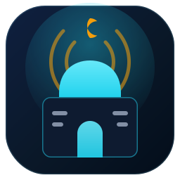
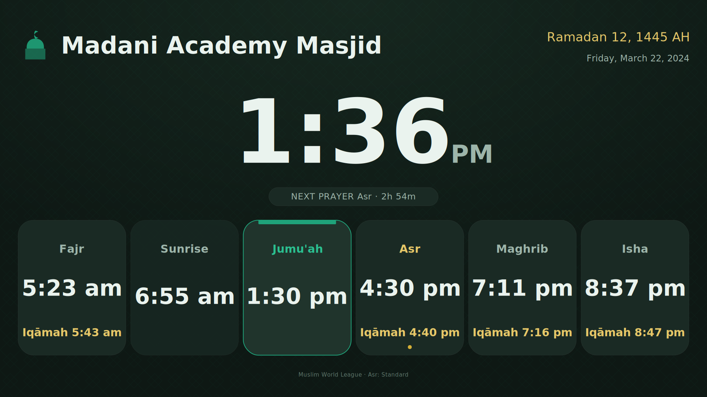
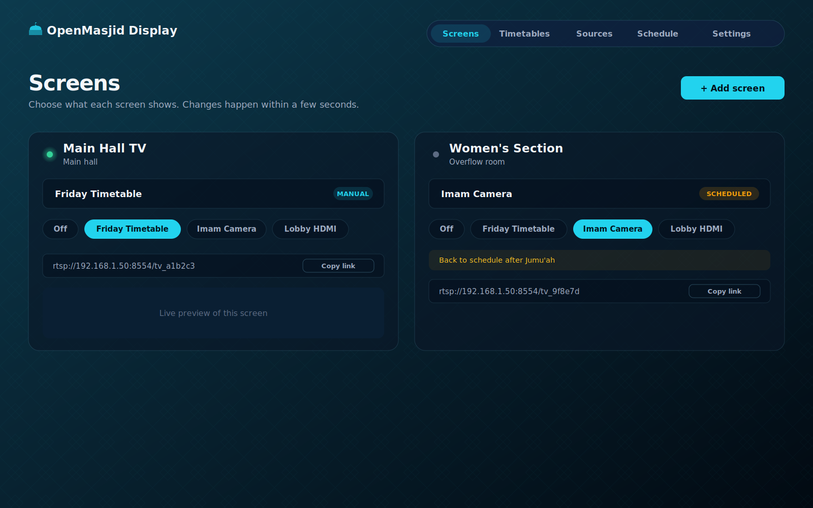

<div align="center">



# OpenMasjid Display

**Run prayer timetables, cameras and HDMI on every screen in your masjid — over your network.**

An app for [OpenMasjidOS](https://github.com/hasan-ismail/OpenMasjidOS). Free and open source (AGPL-3.0).

</div>

---

OpenMasjid Display turns one small computer (a mini-PC, a Raspberry Pi, or a Proxmox container) into the
control room for every TV in your masjid. Each screen gets its own network video link (**RTSP**) that you
point a cheap RTSP-to-HDMI decoder box at **once** — then you decide, from your phone or a computer, what
each screen shows:

- 🕌 **Prayer timetables** — beautiful, full-screen prayer clocks calculated on the device (no internet
  needed). Make as many as you like, each with its own colours to match the room it hangs in. Shows a large
  live clock, the Hijri and Gregorian dates, every prayer's **Adhan and Iqamah** time, Jumu'ah, and a gentle
  countdown to the next prayer with the current prayer highlighted.
- 📷 **Cameras** — bring in any IP/security camera or an imam camera and put it on a screen with one tap
  (great for overflow rooms and the women's section).
- 🖥️ **HDMI sources** — plug a laptop or a recording into an HDMI-to-network encoder and send it to the
  screens you choose.
- 🗓️ **Schedules** — switch a screen to the imam camera for Jumu'ah, then back to the timetable afterwards,
  automatically. A volunteer can always take over instantly from the simple mobile page.

<div align="center">


</div>

## How it works

```
  Phone / laptop ─▶ Control panel (web)               ┌─ Timetable renderer (SVG → ffmpeg) ─┐
                         │  REST + WebSocket           │                                     ▼
                         ▼                             │                              ┌─────────────┐
                  OpenMasjid Display (Node)  ──────────┘   add/patch paths (API)      │  MediaMTX   │
                         │                              ───────────────────────────▶  │ RTSP server │
                         │  relays cameras / HDMI (on-demand)                          └──────┬──────┘
                         └─────────────────────────────────────────────────────────────────  │  RTSP/TCP :8554
                                                                                              ▼
                                                          Each TV's RTSP decoder ── rtsp://<server>:8554/tv_xxxx
```

- Each screen is a **stable RTSP path** (`…/tv_xxxx`). Switching what a screen shows is a single live API
  call — the decoder keeps the same URL.
- Timetables are rendered to a lightweight low-frame-rate **H.264** stream (built as an SVG, rasterised, and
  encoded by ffmpeg) and published into [MediaMTX](https://github.com/bluenviron/mediamtx).
- Cameras and HDMI encoders are **relayed on demand** (only pulled while a screen is watching), or optionally
  re-encoded to a fixed H.264 geometry for maximum decoder compatibility.

See [docs/ARCHITECTURE.md](docs/ARCHITECTURE.md) for the full design.

## Install (through OpenMasjidOS)

This app installs from the OpenMasjidOS **App Store**. Once it's in the catalog, open your dashboard → App
Store → **OpenMasjid Display** → Install. **There's nothing to fill in** — it's a one-click install.

To add it to the catalog, open a PR to [OpenMasjidAPPS](https://github.com/hasan-ismail/OpenMasjidAPPS)
adding this entry to `registry.yaml`:

```yaml
  - id: display
    repo: hasan-ismail/OpenMasjidDisplay
    ref: v0.2.0
```

### No install-time settings

By design, the install dialog is empty — you set everything up **inside the app** on first run (your
admin password, masjid details, server address, screens, cameras, schedules), all saved to the data volume.
This keeps install one-click and lets you change anything later without reinstalling.

## After installing

1. Click **Open** (the control panel, default host port `7860`) and **create your control-panel password**.
2. Go to **Settings** → set this server's network address (your LAN IP) → **Save**.
3. On the **Screens** page, add a screen and **copy its link**.
4. In your TV's RTSP decoder, paste the link and set the transport to **TCP**.
5. Pick what each screen shows (a timetable, a camera, an HDMI source). Done.

Full decoder guidance and troubleshooting: [docs/RTSP_SETUP.md](docs/RTSP_SETUP.md).

## Hardware notes (it's meant to be light)

- The timetable stream is mostly static and runs at a low frame rate, so a **Raspberry Pi 4/5** comfortably
  drives one or two screens at 720p. Use a mini-PC for 1080p or many screens.
- Relaying a camera "Direct" costs almost no CPU. The "Most compatible" (re-encode) option is heavier — use
  it on a mini-PC, or only where a screen won't play the camera directly.
- RTSP is forced to **TCP** for the widest, most firewall-friendly compatibility with commodity decoders.

## Run / build from source

```bash
# server (control plane + renderer)
cd server && npm install && npm run build && npm test

# control panel (web)
cd web && npm install && npm run build

# everything together (Docker; also what the App Store runs)
docker compose up -d
```

For local development, run the server (`cd server && npm run dev` then `node dist/index.js`) with a local
MediaMTX, and `cd web && npm run dev` (proxies `/api` and `/ws` to the server).

## Security

- Runs least-privilege: no privileged mode, host networking, devices, or Docker socket.
- The control panel is protected by a single admin password (Argon-free signed, HTTP-only session cookie).
- Camera credentials embedded in RTSP links are never shown in the panel.
- On a shared network, set a control-panel password and keep RTSP on your LAN.

## License

[AGPL-3.0](LICENSE). The prayer-time engine is original work reused from the OpenMasjidAPPS
`prayer-times-display` example by the same author.
